# O que é Amazon Bedrock 

Essa ferramenta é uma API REST que nos ajuda a criar e utilizar uma IA generativa exclusiva sua,
ou da sua empresa, simplesmente através do seu consumo, isto é, enviando e recebendo JSONs a uma API.

## Complexidade de uma simples lei
Com o grande crescimento da tecnologia em diversas áreas, é imprescindível estabelecer regras para um 
crescimento sadio no que concerne a posse e uso dos dados das pessoas. 
Foi então que se criou a Lei Geral de Proteção de Dados (LGPD), que visa estabelecer normas para o tratamento
de dados no território brasileiro.

Diante da complexidade que se tem em uma lei, seja ela qual for, empresas por todo o país precisaram 
contratar profissionis, ou escritórios de advocacia, para ajudar e auxiliar no cumprimento da lei.
Muitas empresas precisaram desembolsar altas quantidades de dinheiro tanto para times de 
desenvolvimento adequar o software as regras, quanto para as pessoas profissionais de direito.

Não sendo suficiente apenas capacitar profissionais de tecnologia a respeito da LGPD, 
as consultorias jurídicas passaram a ser um custo efetivo do desenvolvimento de software, 
seja para novas aplicações ou para implementação de novas features em aplicações já existentes.

## Solução - O Amazon Bedrock
Para ajudar com a diminuição dos custos com consultoria jurídica, a AWS pode nos ajudar em uma
solução inovadora e muito descomplicada: o Amazon Bedrock. 

Com o Amazon Bedrock, a interação com a inteligência artificial se torna decomplicada, 
resumindo se apenas a consumos de API REST. Parece fácil, não é mesmo? E realmente é.
É possível, através de consumo da API do Amazon Bedrock, ensinar uma inteligência artificial (IA) 
e interagir com ela para obter respostas acerca do que foi ensinado.

Em nosso caso, ensinamos sobre a LGPD para a IA através do Amazon Bedrock e
passamos a enviar perguntas a API para obter as respostas sobre a lei.
E pense que essa solução poderia ser expandida para qualquer outro assunto. 
Para ensinar o Amazon Bedrock, basta interagir com a API enviando o texto da lei,
ou em formato PDF também, com alguns parâmetros adicionais e 
passar a enviar perguntas para obter as respostas.

## Configuração de acesso ao Amazon Bedrock

A utilização do Bedrock se dá através da linguagem Python pela biblioteca boto3

Para configuração do ambiente, precisamos:

1. Acessar a ferramenta pela conta AWS Console

Para acessar o Amazon Bedrock, basta entrar na página inicial do console da AWS, pesquisar 
por Bedrock e acessar o serviço, clicando no ícone Amazon Bedrock, e depois no botão “Get started”
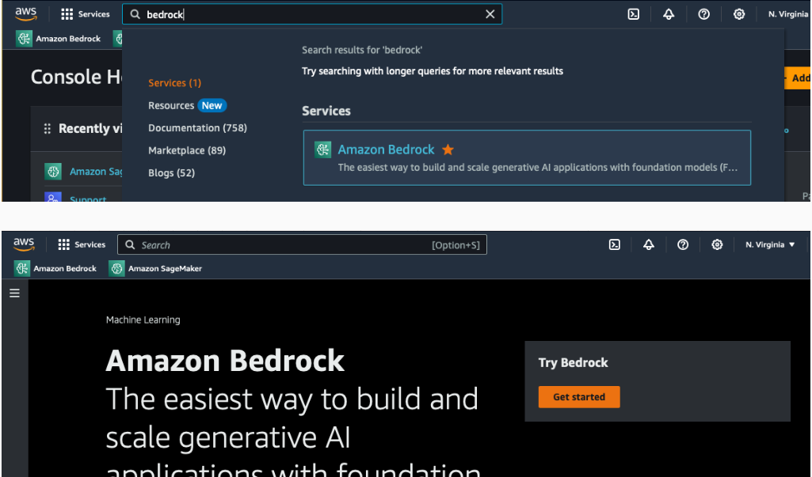

Feito isso, você deve estar na página de Overview do Amazon Bedrock:

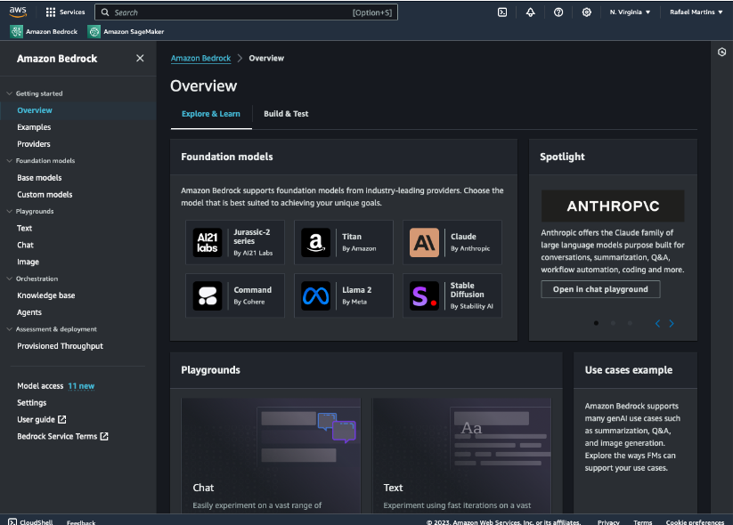

2. Pedir acesso aos modelos

No menu lateral, navegue até Model access, uma lista com todos os modelos deve aparecer.
Então clique no botão Manage model access, no canto superior direito da lista e 
selecione os modelos que quer pedir o acesso. 
Após isso clique no botão Save changes no canto inferior direito da tabela, conforme nas imagens:

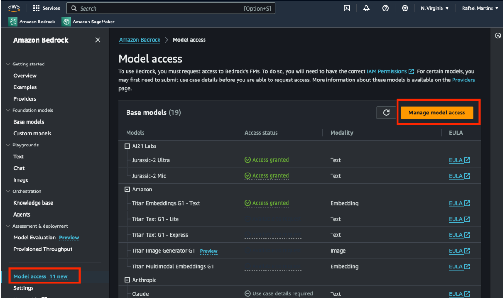
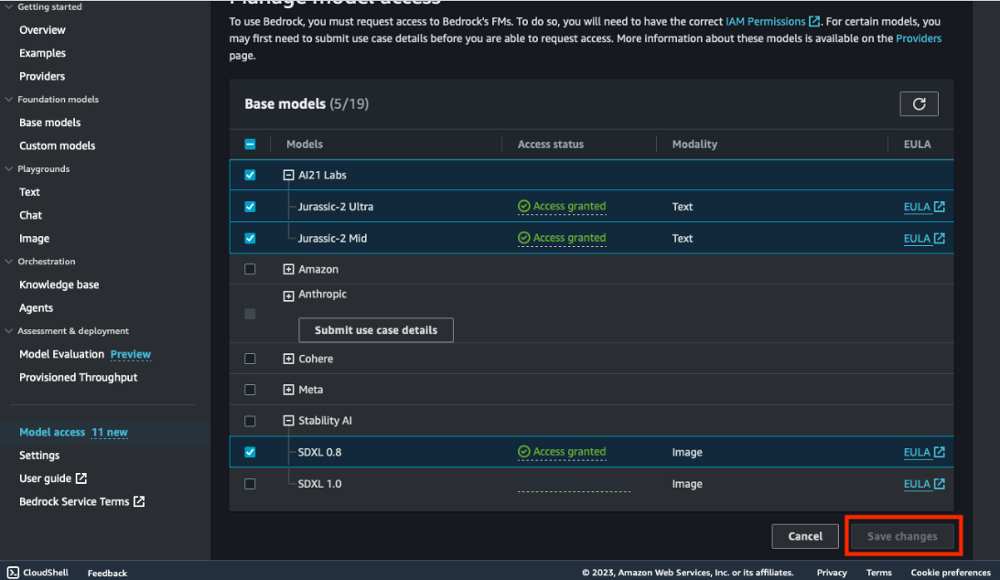

### Playground
Você poderá escolher varios playgrounds, aqui vai o exemplo do Text 

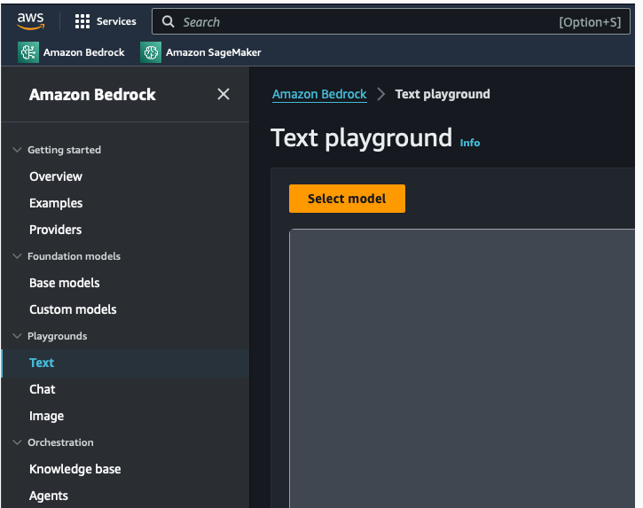
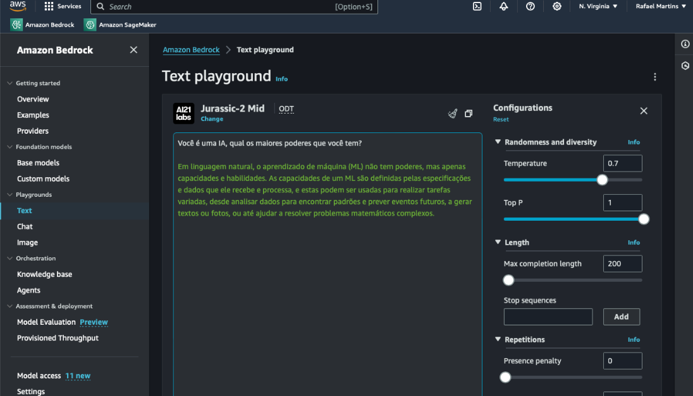

3. Criar um usuário de acesso via código

4. Criar políticas de acesso ao serviço Bedrock

Esse acesso é liberado através das políticas adicionadas no seu Identity and Access Management (IAM).
Para isso, será necessário acessar o IAM no seu console e criar a permissão aos modelos do Amazon Bedrock.

A partir da página do Console Home, pesquise por IAM e entre no serviço IAM:
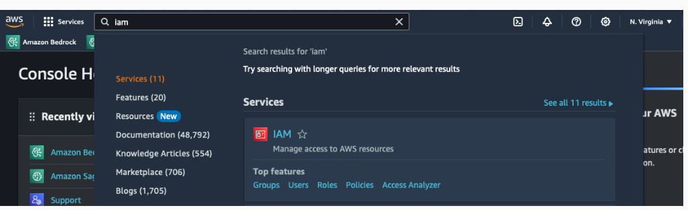

Primeiramente vamos criar a política de permissão através do Policies na seção Access management 
no menu lateral:
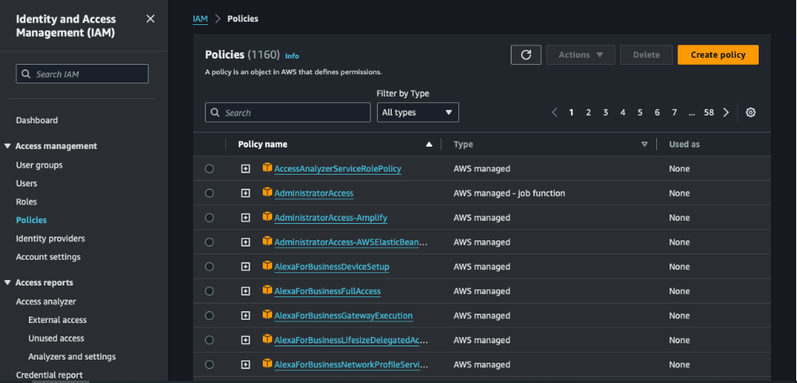

Clique no botão Create policy no canto superior direito.
No passo 1 (Step 1) em Specify permissions selecione a aba JSON, coloque o código abaixo e clique em Next.
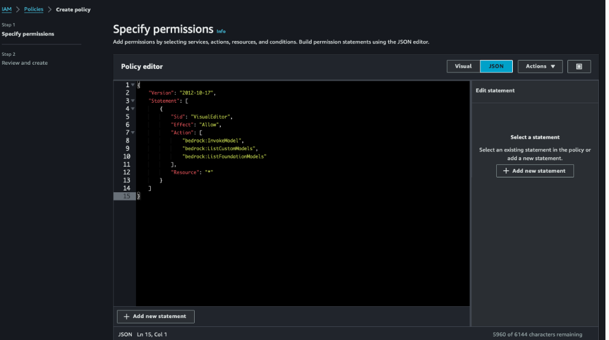
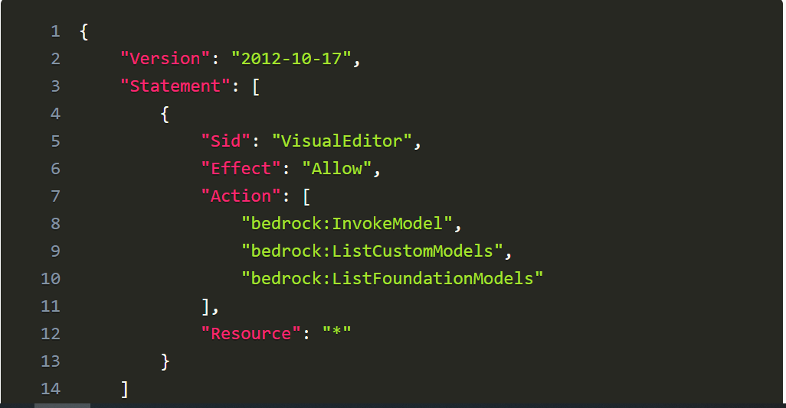

No passo 2 (Step 2), defina um nome para a política, bedrock_policy por exemplo, 
e clique no botão Create policy

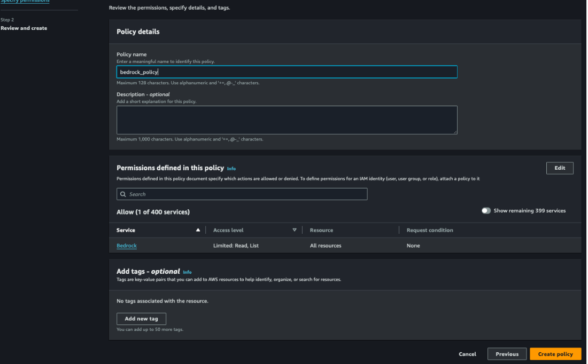

5. Relacionar a política de acesso a um dado usuário

Uma vez a política criada, precisamos associá-la a um user, portanto, no menu lateral, abra o link Users. Caso você não tenha nenhum usuário, clique no botão Create user para criar um novo.

Serão três novos passos, no primeiro definimos o nome do usuário
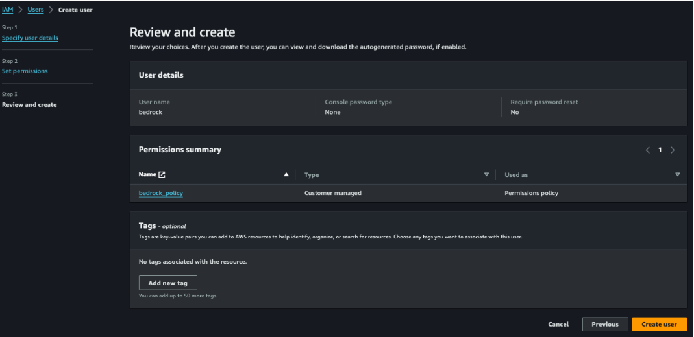

Caso você queira adicionar a nova política a um usuário já existente, 
basta clicar sobre o usuário desejado, seguir para aba Permission,
clicar no botão Add permissions e então na opção Add permissions novamente.

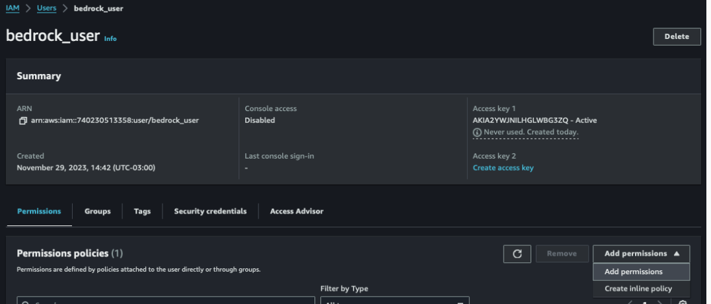

