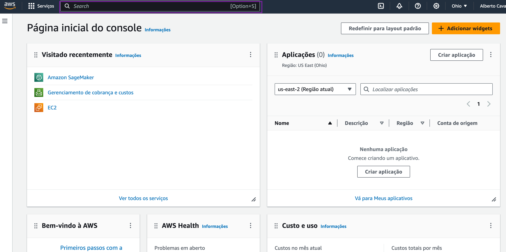
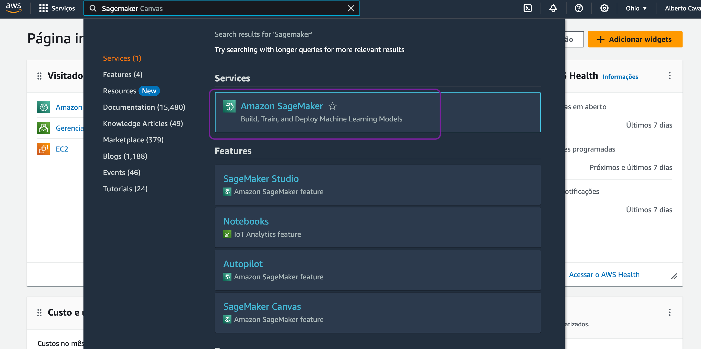
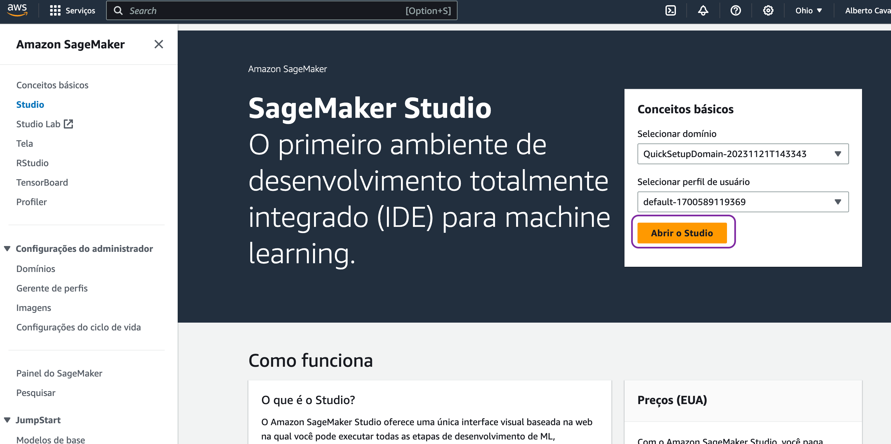

# Amazon Sagemaker 
Uma ferramenta da AWS a qual permite fazer algo mais elaborado do que o Bedrock ou algo enorme que contacta direto o Modelo Fundacional e trabalha a partir daí.

Enquanto o Bedrock pode ser adequado para casos de uso mais diretos e específicos que requerem acesso a modelos de IA generativa, o SageMaker se destaca em cenários que exigem um alto grau de personalização, complexidade e capacidade de experimentação e otimização contínua.

## Como acessar o Sagemaker?
- Você começa, como de costume, no console da AWS. Vá na barra superior e digite Sagemaker

- Acesse o console da AWS e digite de “Sagemaker” na barra de busca|

A seguir, clique na ferramenta quando esta aparecer na busca para acessá-la.

- Já dentro da ferramenta, você deverá criar um domínio e, dentro desse, um usuário para usar a ferramenta com as configurações e permissões adequadas. Há uma opção na direita da tela para configuração rápida. Clique lá e, quando pedido, complete com as informações que necessárias.

Lembrando: se seu acesso à AWS estiver vinculado à sua organização, busque apoio internamente para fazer a configuração adequada de domínio, usuário e permissões.

|Clique na opção de configuração rápida de um único usuário|

- Com a configuração feita, recarregue a página inicial do Sagemaker e, na direita, selecione o domínio e o usuário criados. Você já pode abrir o estúdio! 🎊

## Quando a cobrança vem?
Aqui, você irá pagar na hora de usar máquinas da AWS para processar ou fazer deploy de seus modelos e aplicações - então o cadastro não incorre em nenhum gasto, nem o uso do estúdio por si só. Quando você abrir um notebook para trabalhar, para rodá-lo, você precisará de escolher a instancia da AWS com a qual quer trabalhar. Aí que entra a parte de custos.

Na dúvida, escolha a menor instancia que puder e só deixe-a maior se ela não atender às suas necessidades, e tenha atenção para não esquecer nada ligado se fizer uma implantação. Na dúvida, acompanhe seus gastos pela parte de Billing acessível via console da AWS e acione o suporte se necessário. Mas, por ora, não se preocupe com isso, somente abra o estúdio sem rodar nada. 