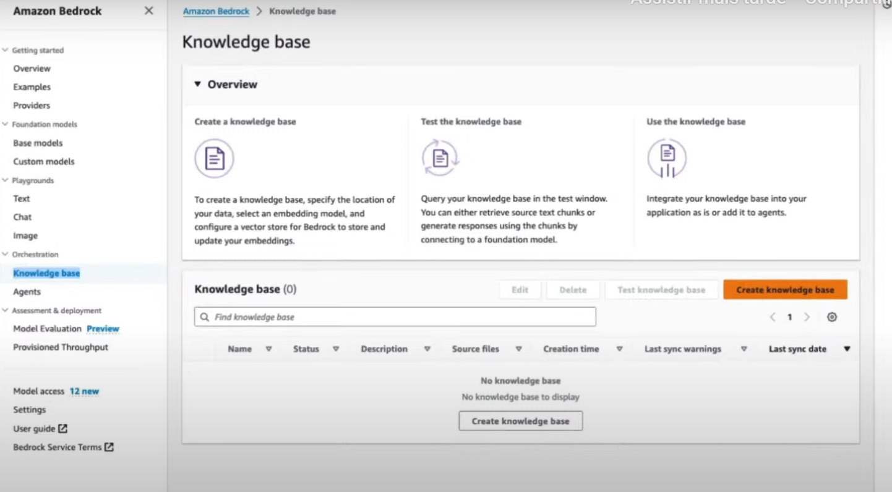
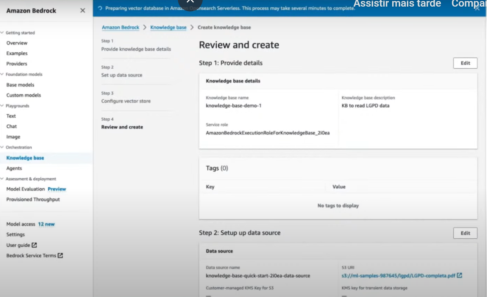

# Amazon Bedrock 
1) No console clicar no Amazon Bedrock 

2) Dentro do Amazon Bedrock temos o menu de modelo de acesso,  clicar em managem model acess, 
você escolher os modelos , e após escolher clique em salve changes .  

3) No proprio console tem o playground onde você pode escolher os provedores de modelos 

Exemplo de Text playground 

Exemplo de geração de imagem : abaixo ele pede um novo produto, o qual teria que ser uma caixa azul com o logo da AWS

## Usando o Bedrock interação usando um arquivo

1) No menu a esquerda Knowledege base

2) Clique em create Knowledge base

3) Insira um nome , uma descrição , uma role , em tags tem a opção de apontar um arquivo no S3 e clique em next ,
e crie uma base vetorial e aperte next.

4) Vai criar um open source serveless (onde irá armazenar os vetores e é uma base serveless)

5) Na collections no menu a esquerda , é a collection que o Bedrock criou automaticamente 

6) Então irá clicar em Sync que seria para sincronizar com o arquivo que apontou no S3 e converter o pdf para vetor

7) VocÊ escolhe o modelo que irá interagir , no exemplo abaixo foi utilizado o claude , observe que ele faz um pergunta 
e o claude responde baseado no arquivo que foi sincronizado ou seja foi criado um chatbot 

8) 
