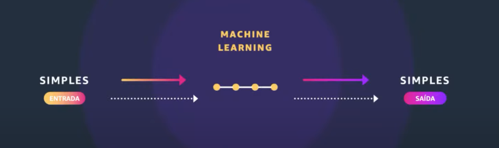
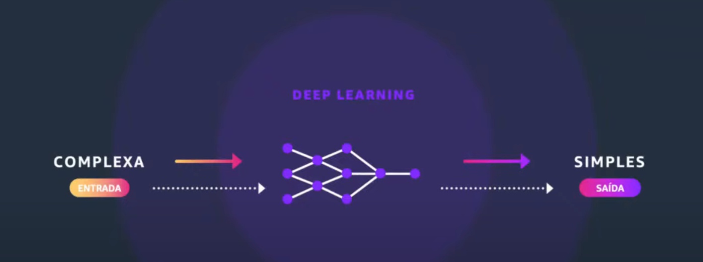
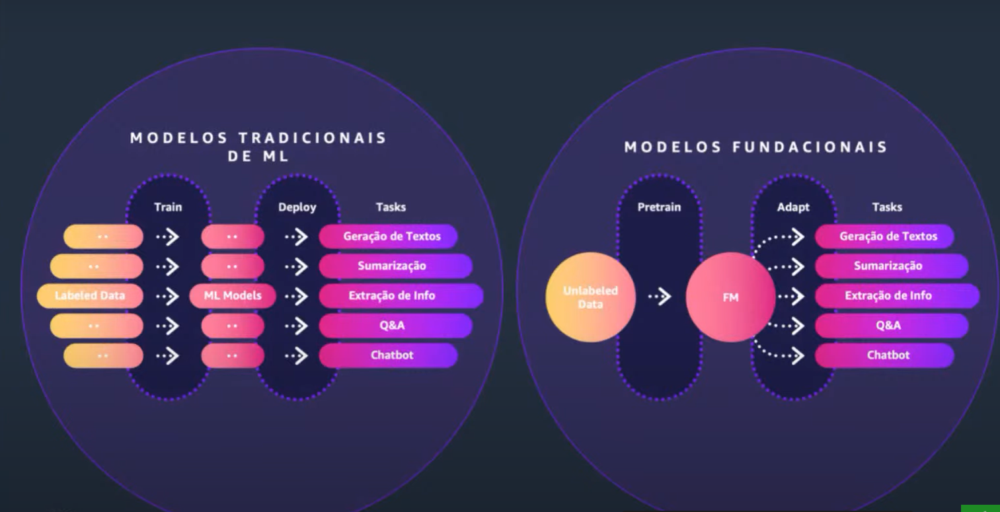
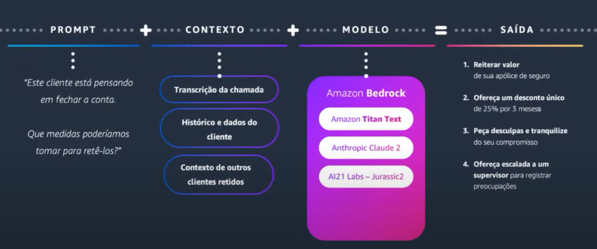
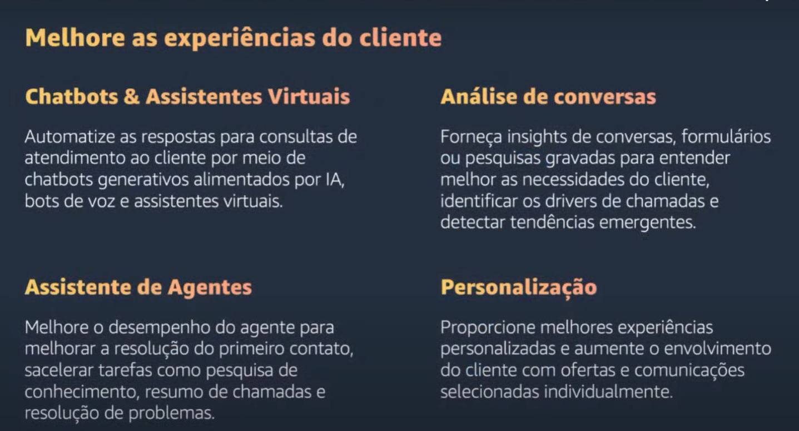
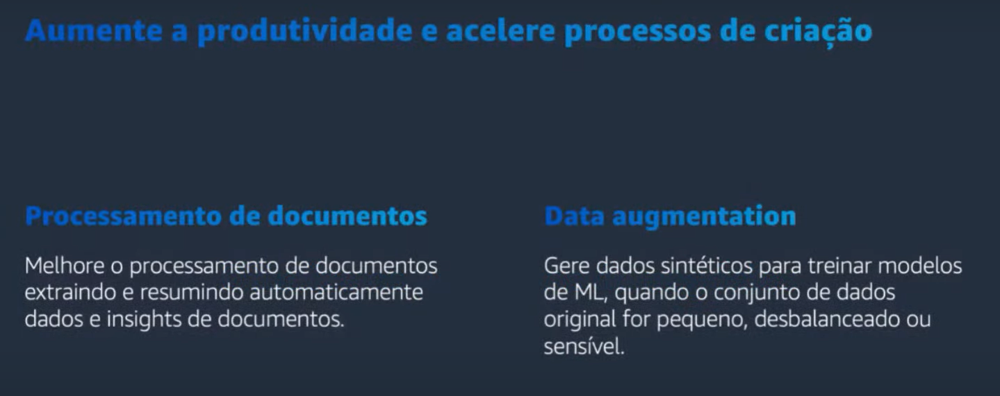

# Introdução à IA Generativa na AWS
- IA generativa pode transformar todas as industrias

## Ponto de inflexão para IA Generativa 

- Profileração massiva de dados
- Disponibilidade de capacidade computacional escalável 
- Inovação em aprendizado de máquina 

## Machine Learning

- aprendizado de maquina de forma mais simples trabalhando com entradas ou solicitações ao sistema ao computador
a fim de trazer uma resposta mais simples

## Deep Learning 
- Entrada com problemas complexos para interpretação simples do computador
- Possibilitando análises entre imagens e videos 
- Como funciona debaixo do pano : 
Ex: pegar uma foto e essa foto é transformada numa matriz numérica
com numero equivalente de tons em cada pixels, então vai transformar uma foto em uma matriz com monte de número
correspondendo ao tom de pretos entre zeros e um vamos dizer assim tons de cores ali e eu vou usar essas foto e
essas cores pra treinar um modelo e treinar esssa função, nesse caso treinou deep learning.

## IA Generativa 

- Possibilita interagir de forma complexa (entrada de dados complexas) e gerar um resultado complexo (saída complexa)
- Uso de dados grande , uso de dataset público, existe modelos que fazem webcrawler de sites e informações,
eles não rotulam isso, eles jogam monte de texto, treinam modelos que demoram até meses dependendo desse modelo usando
muito a capacidade de processamento , e esse modelo ao final consegue fazer diversas tarefas

### Modelos tradicionais de ML X Modelos fundacionais 
- Antes precisa de 5 modelos , hoje somente 1 modelo para fazer as mesmas tarefas.
- Realizar tarefas distintas no mesmo modelo 

### Como interagem com esse tipo de modelo 

Começamos com um tipo de prompt , um comando que irá fazer com esse modelo, que precisa passar um contexto para ter
algo , ter uma resposta ou ter uma instrução do resultado mais adptado para interagir com um modelo a fim de obter
um resultado

### Principais pilares de IA Generativa 
#### Melhoria da experiência dos clientes

#### Aumente a produtividade e acelere processos de criação

#### Otimize os processos de negócios 

