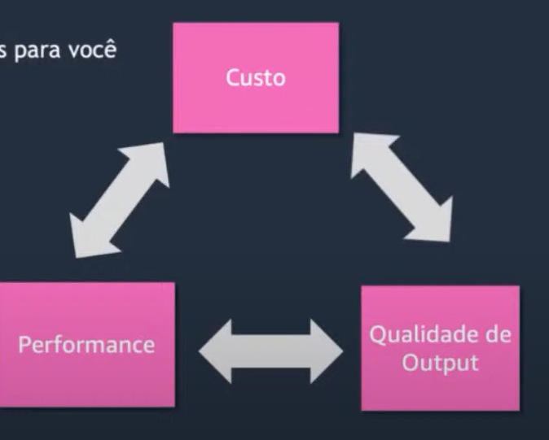

# IA Generativa na AWS

## Maneiras de usar a IA genrativa

3 perfis de empresas: 

- Provedores de modelo: Construa seu próprio modelo fundacional do zero
- Customizadores de modelos : Comece com modelos fundacionais disponíveis publicamente 
- Consumidores de modelos : Use serviços de IA generativa ou APIs oferecidos por fornecedores de modelos fundacionais

## Principais pilares da IA Generativa na AWS

- Aplicativos que aproveitam LLMs e outros FMS
- Ferramentas para construir com FMs
- Infraestrutura para treinamento e inferência de FMs

## Considerações importantes 
- Modelos de fundação sozinhos não conseguem realizar tarefas
- O seu dado é o seu diferencial competitivo

## Principais considerações sobre a seleção de FM

 - Modelos não são necessariamente melhores/certos para você 
 - Não há um modelo de fundação único que atenda a todos os seus requisitos

- O modelo certo deve encontrar um equilibrio entre : 

    
